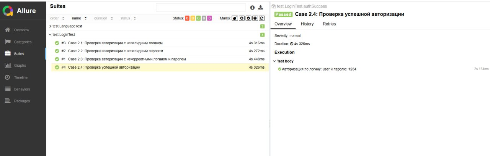
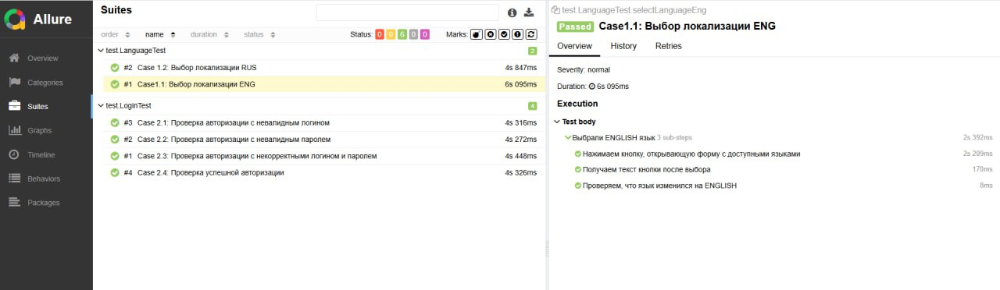
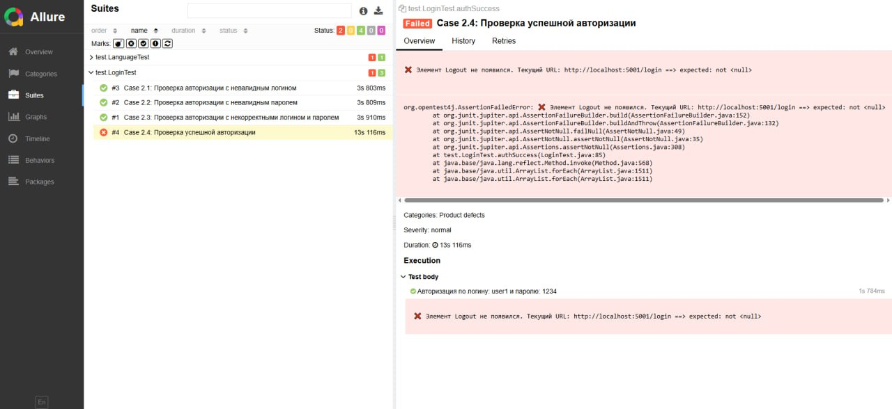
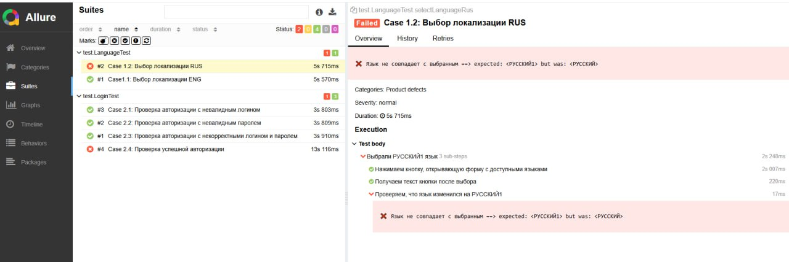

# Фреймворк для E2E тестирования (Java + Selenium)

## Что внутри

src/  
├── main/java/  
│   ├── base/          # Базовые классы (BasePage, TestData, TestBase)  
│   ├── helpers/       # Вспомогательные методы (AuthHelper)  
│   └── page/          # Page Object'ы (LoginPage, LanguageSelectComponent)  
└── test/java/test/    # Тесты (LoginTest, LanguageTest)

## Технологии

- Java 17
- Selenium WebDriver 4.16
- JUnit 5
- Maven
- Allure Reports
- WebDriverManager

## Архитектура

**BasePage (абстрактный класс)**
- Содержит общие методы для всех страниц: клики, ввод текста, ожидания
- Все Page Object'ы наследуются от него

**TestData**
- Хранит тестовые данные и URL'ы
- Значения могут переопределяться через системные свойства

**Page Object'ы**
- Локаторы
- Методы действий
- Композитные методы

**Тесты**
- Наследуются от TestBase
- Шаги размечены для Allure  

**AuthHelper**
- Содержит метод для авторизации
- Переиспользуется в разных тестовых классах

## Отчётность Allure

**Примеры отчётов:**

### Проверка успешной авторизации 


### Проверка успешного выбора локализации


### Ошибка при авторизации


### Ошибка при выборе локализации


## Команда для запуска тестов с отчётом
```bash
mvnw.cmd clean test & mvnw.cmd allure:serve